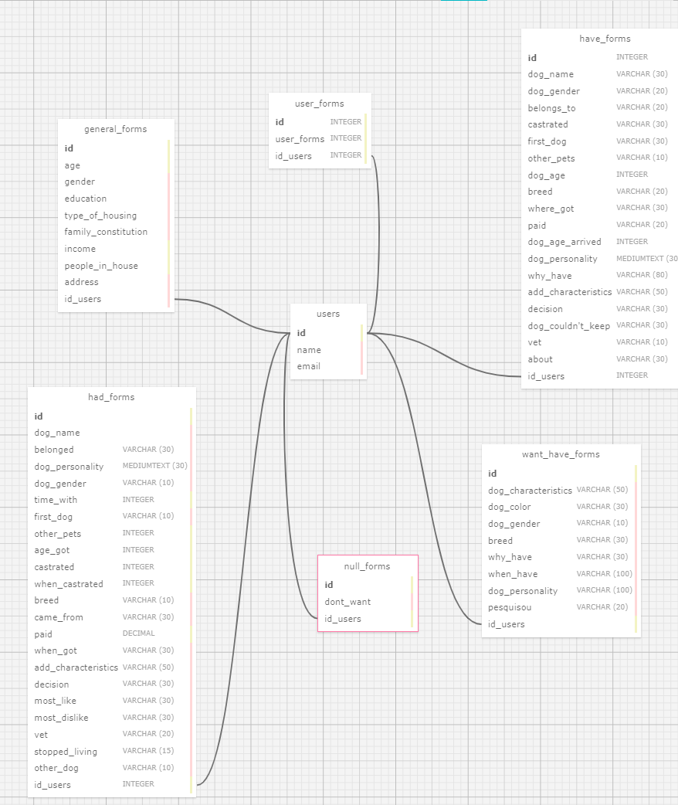

## Documentação Simplificada do Modelo Relacional

**Projeto:** Abandono Zero

**Data:** 2024-05-11

**Autor:** Leonardo Ogata Pedrosa

**Objetivo:** Essa é a representação visual do estrutura relacional de dados do projeto Abandono Zero, que tem o objetivo de fornecer uma base de dados sobre os principais motivos sobre adoção, compra e abandono de animais para que mais pesquisas sobre esse assunto possam ser desenvolvidos futuramente. A modelagem a seguir apresenta as entidades, seus atributos e os relacionamentos entre elas, proporcionando uma visão clara e organizada do banco de dados.

&nbsp;&nbsp;&nbsp;&nbsp; Abaixo encontra-se os dois arquivos para baixar, sobre a modelagem relacional e a física:

- [Modelagem Relacional](https://github.com/Leoogata/Modelo-Relacional-Leonardo-Ogata/blob/main/modelagem-relacional.xml)
- [Modelagem Física](https://github.com/Leoogata/Modelo-Relacional-Leonardo-Ogata/blob/main/modelagem-fisica.sql)

## Entidades

### Users
- **Primary Key**: Armazena informações básicas sobre os usuários (nome e email).
- **Primary Key**: id
- **Atributos**: 
    - **id**: `INTEGER` (Chave primária, identificador único)
    - **name**: `VARCHAR(50)` (Nome do usuário)
    - **email**: `VARCHAR(50)` (Email do usuário)

### user_form
- **Descrição**: Define qual formulário será preenchido pelo usuário
   - **user_form**: `VARCHAR(50)` (Escolha de qual formulário o usuário vai responder)
   - **Chave Primária**: id
   - **Chave Estrangeira**: `id_users` referenciando `users.id`.
   
### General_forms
  - **Descrição**: Armazena detalhes gerais sobre o usuário, incluindo informações demográficas e socioeconômicas.
- **Chave Primária**: id
- **Chave Estrangeira**: `id_users` referenciando `users.id` `(UNIQUE)`.
- **Atributos**:
    - **id**: `INTEGER` (Chave primária, identificador único)
    - **age**: `INTEGER` (Idade do usuário)
    - **gender**: `VARCHAR(10)` (Gênero do usuário)
    - **education**: `VARCHAR(50)` (Escolaridade do usuário)
    - **type_of_housing**: `VARCHAR(50)` (Tipo de moradia do usuário)
    - **family_constitution**: `VARCHAR(100)` (Constituição familiar)
    - **income**: `DECIMAL(10,2)` (Renda familiar mensal)
    - **people_in_house**: `INTEGER` (Quantidade de pessoas que moram na casa)
    - **address**: `VARCHAR(255)` (Endereço do usuário)

### have_forms
- **Descrição**: Armazena detalhes sobre o cão mais recente que o usuário possui.
- **Chave Primária**: `id`
- **Chave Estrangeira**: `id_users` referenciando `users.id`.
- **Atributos**:
    - **id**: `INTEGER` (Chave primária, identificador único)
    - **dog_name**: `VARCHAR(30)` (nome do cão)
    - **dog_gender**: `VARCHAR(20)` (gênero do cão)
    - **belongs_to**: `VARCHAR(20)` (a quem o cão pertence)
    - **castrated**: `VARCHAR(30)` (Se o cão foi castrado)
    - **first_dog**: `VARCHAR(50)` (Se o cão é o primeiro da família)
    - **other_pets**: `VARCHAR(10)` (Se o usuário possui outros pets)
    - **dog_age**: `INTEGER` (idade do cão)
    - **breed**: `VARCHAR(20)` (raça do cão)
    - **where_got**: `VARCHAR(20)` (De onde o cão veio)
    - **paid**: `DECIMAL` (Quanto foi pago pelo cão)
    - **dog_age_arrived**: `INTEGER` (Idade que o cão tinha ao chegar na casa)
    - **dog_personality**: `TEXT` (Características da personalidade do cão)
    - **why_have**: `TEXT` (Por que decidiram ter o cachorro)
    - **add_characteristics**: `VARCHAR(50)` (Mais informações relevantes sobre o cão)
    - **decision**: `VARCHAR(30)` (Quem participou da decisãop de ter o cachorro)
    - **dog_couldn't_keep**: `VARCHAR(10)` (O que o usuário diz sobre o cão)
    - **vet**: `VARCHAR(10)` (Se o cachorro foi ao veterinário)
    - **about**: `VARCHAR(30)` (Mais informações sobre o cachorro)

### had_forms
- **Descrição**: Armazena detalhes sobre o cão mais recente que o usuário teve.
- **Chave Primária**: `id`
- **Chave Estrangeira**: `id_users` referenciando `users.id`.
- **Atributos**:
    - **id**: `INTEGER` (Chave primária, identificador único)
    - **dog_name**: `VARCHAR(30)` (nome do cão)
    - **belonged**: `VARCHAR(20)` (a quem o cão pertencia)
    - **dog_personality**: `VARCHAR(20)` (personalidade do cão)
    - **dog_gender**: `VARCHAR(30)` (gênero do cão)
    - **time_with**: `VARCHAR(50)` (tempo com o cão)
    - **first_dog**: `VARCHAR(10)` (Se foi o primeiro cão)
    - **other_pets**: `INTEGER` (outros pets)
    - **age_got**: `VARCHAR(20)` (idade que obtiveram o cão)
    - **castrated**: `VARCHAR(20)` (Se o cão é castrado)
    - **when_castrated**: `DECIMAL` (Quanto foi pago pelo cão)
    - **breed**: `INTEGER` (raça do cão)
    - **came_from**: `TEXT` (de onde o cão veio)
    - **paid**: `TEXT` (Se pagaram pelo cão)
    - **when_got**: `VARCHAR(50)` (quando o cão foi pego)
    - **add_characteristics**: `VARCHAR(30)` (Características do cão)
    - **decision**: `VARCHAR(10)` (Quem participou da decisão de ter o cão)
    - **most_like**: `VARCHAR(10)` (Características que mais gostava do cão)
    - **most_dislike**: `VARCHAR(30)` (Características que mais desgostava do cão)
    - **vet**: `VARCHAR(30)` (Se o cachorro foi ao veterinário)
    - **stopped_living**: `VARCHAR(30)` (Quando o cachorro deixou de viver com a família)
    - **other_dog**: `VARCHAR(30)` (Se possui outro cachorro)

### want_have_forms
- **Descrição**: Armazena detalhes sobre o cão que o usuário deseja ter.
- **Chave Primária**: `id`
- **Chave Estrangeira**: `id_users` referenciando `users.id`.
- **Atributos**:
    - **id**: `INTEGER` (Chave primária, identificador único)
    - **dog_characteristics**: `VARCHAR(30)` (características do cão)
    - **dog_color**: `VARCHAR(20)` (cor do cão)
    - **dog_gender**: `VARCHAR(20)` (gênero do cão)
    - **breed**: `VARCHAR(30)` (raça do cão)
    - **why_have**: `VARCHAR(50)` (porque gostaria de ter o cão)
    - **when_have**: `VARCHAR(10)` (quando pretende ter um cão)
    - **dog_personality**: `INTEGER` (personalidade do cão)
    - **pesquisou**: `VARCHAR(20)` (Se o usuário pesquisou sobre ter animais)

### null_forms
- **Descrição**: Armazena detalhes sobre usuários que não querem ter um cão.
- **Chave Primária**: `id`
- **Chave Estrangeira**: `id_users` referenciando `users.id`.
- **Atributos**:
    - **id**: `INTEGER` (Chave primária, identificador único)
    - **dont_want**: `VARCHAR(30)` (motivos pelos quais o usuário não quer ter um cão)

## Relacionamentos

&nbsp;&nbsp;&nbsp;&nbsp;&nbsp;&nbsp;Os relacionamentos entre as entidades são fundamentais para entender como os dados são interligados e como as operações de CRUD (Create, Read, Update, Delete) afetam essas entidades. Aqui estão os relacionamentos detalhados entre as entidades:

- **users**:
  - **general_forms**: Um usuário pode ter apenas um formulário geral (`1:1`). A chave estrangeira `id_users` na tabela general_forms agora é única para refletir essa relação.
   - **user_form**: Um usuário pode ter apenas um user form (`1:1`). 
  - **have_forms**: Um usuário pode ter vários formulários de cães que já possui (`1:N`).
  - **had_forms**: Um usuário pode ter vários formulários de cães que já teve (`1:N`).
  - **want_have_forms**: Um usuário pode ter vários formulários de cães que deseja adotar (`1:N`).
  - **null_forms**: Um usuário pode ter vários formulários de cães que nunca conviveu ou não tem vontade de ter (`1:N`).

- **general_forms**:
  - Relacionado diretamente com `users` através da chave estrangeira `id_users`.

- **user_forms**:
  - Relacionado diretamente com `users` através da chave estrangeira `id_users`.

- **have_forms**:
  - Relacionado diretamente com `users` através da chave estrangeira `id_users`.
  - Relacionado com `user_forms` através da chave estrangeira `id_have_forms`.
  - Relacionado com `dog_forms_have` através da chave estrangeira `id_have_forms`.

- **had_forms**:
  - Relacionado diretamente com `users` através da chave estrangeira `id_users`.

- **want_have_forms**:
  - Relacionado diretamente com `users` através da chave estrangeira `id_users`.
  - Relacionado com `user_forms` através da chave estrangeira `id_want_forms`.
  - Relacionado com `dog_forms_want` através da chave estrangeira `id_want_have_forms`.

- **null_forms**:
  - Relacionado diretamente com `users` através da chave estrangeira `id_users`.

## Regras de Negócio

&nbsp;&nbsp;&nbsp;&nbsp;&nbsp;&nbsp;As regras de negócio são diretrizes que garantem a integridade dos dados e a lógica de negócios do sistema. As regras de negócio para o projeto Abandono Zero são:

### 1. Validação de Dados

&nbsp;&nbsp;&nbsp;&nbsp;&nbsp;&nbsp;Todos os campos obrigatórios devem ser preenchidos antes de um usuário poder submeter um formulário.

### 2. Consistência de Informações

&nbsp;&nbsp;&nbsp;&nbsp;&nbsp;&nbsp;As informações fornecidas pelos usuários devem ser consistentes entre os diferentes formulários. Por exemplo, o nome do cão deve ser o mesmo em todos os formulários relacionados a esse cão.

### 3. Restrições de Edição

&nbsp;&nbsp;&nbsp;&nbsp;&nbsp;&nbsp;Uma vez que um usuário submete um formulário, ele não pode editar as informações que já foram salvas, exceto em casos específicos autorizados pela administração.

### 4. Política de Privacidade

&nbsp;&nbsp;&nbsp;&nbsp;&nbsp;&nbsp;As informações pessoais dos usuários são protegidas e só podem ser acessadas por funcionários autorizados.

### 5. Regra de Unicidade

&nbsp;&nbsp;&nbsp;&nbsp;&nbsp;&nbsp;Todos os campos dos formulários devem ser preenchidos pelo usuário.

### 6. Regra de Atualização

&nbsp;&nbsp;&nbsp;&nbsp;&nbsp;&nbsp;As informações dos usuários do formulário geral podem ser atualizadas a qualquer momento.

## Diagrama

&nbsp;&nbsp;&nbsp;&nbsp;&nbsp;&nbsp;Este diagrama simplificado ilustra os relacionamentos entre as entidades do modelo relacional. Cada entidade é representada por um retângulo, e os relacionamentos são indicados por linhas conectando as entidades.

## Conclusão

&nbsp;&nbsp;&nbsp;&nbsp;&nbsp;&nbsp;Com essa modelagem de banco de dados atende às necessidades do sistema do projeto Abandono Zero, permitindo o gerenciamento eficiente das informações dos usuários e suas respostas nos formulários. A modelagem apresenta as entidades, seus atributos e os relacionamentos entre elas, proporcionando uma visão clara e organizada do banco de dados. As regras de negócio garantem a integridade e a consistência dos dados.